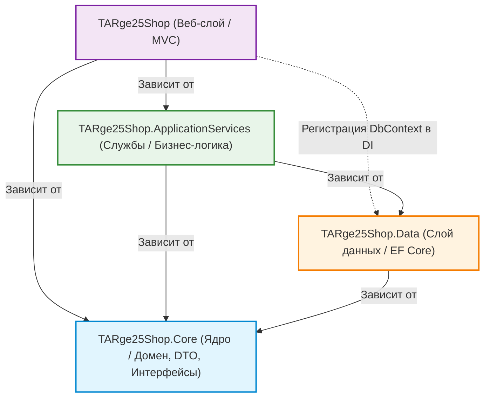
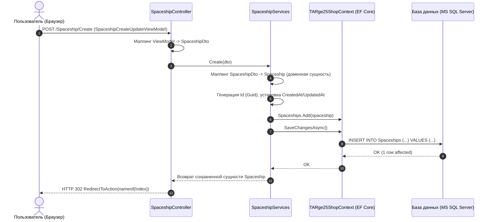

# Архитектура и описание проекта TARge25Shop

## 1. Введение и суть проекта

TARge25Shop — это многослойное веб-приложение на платформе .NET 10 / C#, построенное по принципам чистой / многослойной архитектуры (Clean / Layered Architecture) с использованием паттерна MVC (Model-View-Controller) и ORM Entity Framework Core.

### Назначение проекта
Проект представляет собой модульную систему управления интернет-каталогом / магазином (в текущей реализации базовым модулем является учет космических кораблей — `Spaceship`). Судя по структуре и обозначению `TARge25` (стандартное обозначение групп разработчиков программного обеспечения в Эстонии, Tarkvaraarendaja 2025), проект создан как образовательно-практическая эталонная база для освоения современной корпоративной разработки на C# и .NET.

### Ключевые цели архитектуры
- Разделение ответственности (Separation of Concerns, SoC): разграничение бизнес-логики, работы с данными и пользовательского интерфейса по независимым проектам.
- Инверсия зависимостей (Dependency Inversion Principle, DIP): верхние уровни зависят от абстракций (интерфейсов), а не от конкретных реализаций.
- Изоляция доменных моделей: защита сущностей БД от прямого использования в представлении за счет использования DTO (Data Transfer Objects) и ViewModel.

---

## 2. Технологический стек

| Категория | Технологии |
|---|---|
| Платформа | .NET 10.0 (C# 13/14, SDK 10.0.401) |
| Веб-фреймворк | ASP.NET Core MVC (.NET 10 Web SDK) |
| ORM / Доступ к данным | Entity Framework Core 10.0.11 (Code-First) |
| СУБД | Microsoft SQL Server / LocalDB (`(localdb)\MSSQLLocalDB`) |
| Интерфейс (UI) | Razor Views (.cshtml), Bootstrap 5, jQuery |
| Управление зависимостями | Встроенный IoC/DI контейнер ASP.NET Core |
| Формат конфигурации решения | Новый легковесный XML-формат Visual Studio `.slnx` |

---

## 3. Общая архитектурная схема

Решение разделено на 4 проекта в рамках одного Solution (`TARge25Shop.slnx`):



---

## 4. Детальное описание слоев проекта

### 4.1. `TARge25Shop.Core` (Доменный слой / Ядро)
Центральный слой, не имеющий внешних зависимостей от других проектов системы или сторонних фреймворков доступа к данным. Является контрактом всей системы.

- `Domain/`:
  - `Spaceship.cs` — чистая доменная сущность космического корабля (POCO: `Id`, `Name`, `ShipType`, `Crew`, `EnginePower`, `CreatedAt`, `UpdatedAt`).
  - `Kindergarten.cs` — чистая доменная сущность детского сада (POCO: `Id`, `GroupName`, `ChildrenCount`, `KindergartenName`, `TeacherName`, `CreatedAt`, `UpdatedAt`).
- `Dto/`:
  - `SpaceshipDto.cs`, `KindergartenDto.cs` — объекты передачи данных (Data Transfer Objects). Используются для транспортировки данных между контроллерами представления и бизнес-сервисами, предотвращая прямое раскрытие доменных моделей наружу.
- `ServiceInterface/`:
  - `ISpaceshipServices.cs`, `IKindergartenServices.cs` — интерфейсы сервисов, декларирующие операции CRUD:
    - `Task<T> Create(TDto dto)`
    - `Task<T> Update(TDto dto)`
    - `Task<T> DetailAsync(Guid id)`
    - `Task<T> Delete(Guid id)`

### 4.2. `TARge25Shop.Data` (Слой доступа к данным / Data Access Layer)
Отвечает за персистентность данных и взаимодействие с реляционной базой данных через Entity Framework Core.

- `TARge25ShopContext.cs`:
  - Наследуется от `DbContext`.
  - Регистрирует наборы сущностей:
    - `DbSet<Spaceship> Spaceships { get; set; }`
    - `DbSet<Kindergarten> Kindergartens { get; set; }`
- `Migrations/`:
  - Механизм миграций Code-First.
  - `20260908072731_Init.cs` — создание таблицы `Spaceships`.
  - `20260917113908_KindergartenInit.cs` — создание таблицы `Kindergartens`.

### 4.3. `TARge25Shop.ApplicationServices` (Слой бизнес-логики)
Реализует сценарии использования и бизнес-правила системы.

- `Services/`:
  - `SpaceshipServices.cs` — реализация `ISpaceshipServices`.
  - `KindergartenServices.cs` — реализация `IKindergartenServices`.
  - Получают `TARge25ShopContext` через Dependency Injection.
  - Выполняют трансформацию (маппинг) данных между DTO и доменными сущностями.
  - Управляют генерацией служебных полей (`Guid.NewGuid()`, `CreatedAt`, `UpdatedAt`).
  - Вызывают методы Entity Framework Core (`Add`, `Update`, `Remove`, `SaveChangesAsync`, `FirstOrDefaultAsync`).

### 4.4. `TARge25Shop` (Слой представления / Presentation Layer)
Веб-приложение ASP.NET Core MVC, предоставляющее графический пользовательский интерфейс для конечных пользователей.

- Конфигурация (`Program.cs`):
  - Регистрация сервисов MVC: `builder.Services.AddControllersWithViews()`.
  - Регистрация бизнес-сервисов в DI с областью видимости Scoped:
    - `builder.Services.AddScoped<ISpaceshipServices, SpaceshipServices>()`
    - `builder.Services.AddScoped<IKindergartenServices, KindergartenServices>()`
  - Регистрация контекста БД с подключением к MS SQL Server: `builder.Services.AddDbContext<TARge25ShopContext>(...)`.
  - Настройка конвейера middleware: HTTPS-редирект, роутинг, оптимизированная статика (`MapStaticAssets`), маршрут по умолчанию `{controller=Home}/{action=Index}/{id?}`.
- Контроллеры (`Controllers/`):
  - `HomeController.cs` — главная страница и страница Privacy.
  - `SpaceshipController.cs` — управление сущностями `Spaceship`.
  - `KindergartenController.cs` — управление сущностями `Kindergarten` (Index, Create, Update, Details, Delete/DeleteConfirmation).
- Модели представления (`Models/`):
  - Папки `Models/Spaceship/` и `Models/Kindergarten/` содержат специализированные модели:
    - `IndexViewModel` — оптимизированная модель для списка.
    - `CreateUpdateViewModel` — модель формы ввода/редактирования данных.
    - `DetailsViewModel` — модель отображения деталей.
    - `DeleteViewModel` — модель подтверждения удаления.
- Представления Razor (`Views/`):
  - `Views/Spaceship/` и `Views/Kindergarten/`:
    - `Index.cshtml` — табличный вывод с номерами строк и кнопками действий (Details, Update, Delete).
    - `CreateUpdate.cshtml` — универсальная форма добавления/редактирования.
    - `Details.cshtml` — карточка характеристик.
    - `Delete.cshtml` — страница подтверждения удаления.
  - `Views/Shared/_Layout.cshtml` — верхнее навигационное меню с ссылками на разделы Spaceship и Kindergarten.

---

## 5. Поток обработки данных (Data Flow)

Ниже представлена диаграмма жизненного цикла запроса на примере добавления нового объекта (Create Spaceship):



---

## 6. Применяемые паттерны и принципы проектирования

1. Separation of Concerns (SoC): четкое разграничение ответственности между представлением, бизнес-логикой и хранилищем данных.
2. Dependency Injection (DI): слабая связность компонентов; контроллеры и сервисы получают зависимости через конструкторы.
3. Data Transfer Object (DTO): передача данных между слоями без утечки внутренней структуры домена или базы данных.
4. View Model (MVVM-элемент в MVC): модели представления содержат только данные, необходимые конкретному экрану/форме.
5. Post-Redirect-Get (PRG): после успешных POST-запросов (Create, Update, Delete) выполняется редирект на метод `Index`, предотвращая повторную отправку форм при обновлении страницы в браузере.

---

## 7. Конфигурация и запуск

### Требования
- [.NET 10 SDK](https://dotnet.microsoft.com/download)
- Microsoft SQL Server (LocalDB поставляется вместе с Visual Studio)

### Строка подключения
Находится в `TARge25Shop/appsettings.json`:
```json
"ConnectionStrings": {
  "DefaultConnection": "Server=(localdb)\\MSSQLLocalDB;Database=TARge25Shop;Trusted_Connection=true;MultipleActiveResultSets=true"
}
```

### Команды сборки и применения миграций
```powershell
# Сборка решения
dotnet build

# Применение миграций к базе данных (выполнять из папки решения)
dotnet ef database update --project TARge25Shop.Data --startup-project TARge25Shop

# Запуск веб-приложения
dotnet run --project TARge25Shop
```

После запуска приложение доступно по адресу `https://localhost:7198` или `http://localhost:5242` (согласно `launchSettings.json`).

---

## 8. Архитектурные рекомендации по развитию проекта

1. Инкапсуляция чтения в сервисном слое:
   - В текущей реализации метод `SpaceshipController.Index()` обращается к `_context.Spaceships` напрямую. Рекомендуется добавить метод `GetAll()` или `GetIndexListAsync()` в `ISpaceshipServices`, чтобы контроллер не зависел напрямую от `TARge25ShopContext`.
2. Автоматический маппинг:
   - Для упрощения и предотвращения ошибок ручного маппинга (`ViewModel` ↔ `DTO` ↔ `Domain`) рекомендуется интегрировать библиотеку маппинга (AutoMapper или Mapster).
3. Валидация моделей:
   - Добавить аннотации данных (`[Required]`, `[StringLength]`, `[Range]`) в DTO и ViewModel, либо подключить FluentValidation для валидации бизнес-правил перед сохранением.
4. Обработка загрузки файлов:
   - Форма `CreateUpdate.cshtml` уже содержит атрибут `enctype="multipart/form-data"`. Имеет смысл расширить сущность поддержкой изображений (сохранение файлов в wwwroot или в БД).
5. Модульное тестирование (Unit Tests):
   - Создать проект `TARge25Shop.SpaceshipTest` на базе xUnit/NUnit и Moq для проверки методов `SpaceshipServices` изолированно от базы данных.
