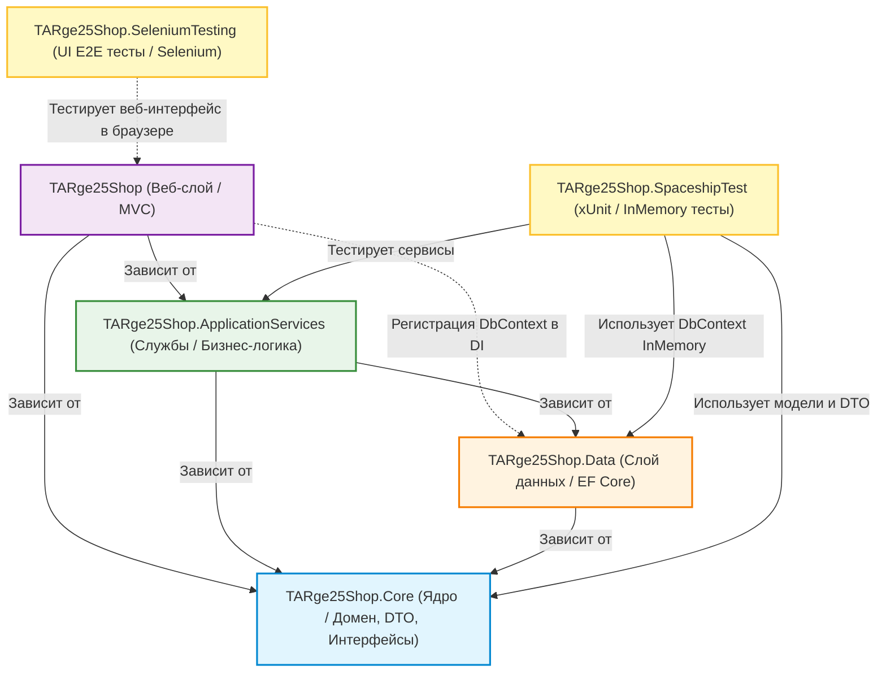
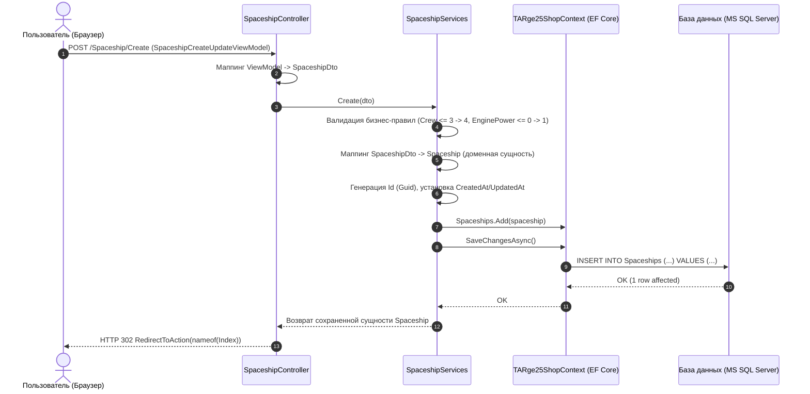

# Архитектура и описание проекта TARge25Shop

## 1. Введение и суть проекта

TARge25Shop — это модульное многослойное веб-приложение на платформе .NET 10 / C#, построенное по принципам чистой / многослойной архитектуры (Clean / Layered Architecture) с использованием паттерна MVC (Model-View-Controller), ORM Entity Framework Core, а также выделенными подсистемами модульного (Unit) и сквозного (E2E/Selenium) тестирования.

### Назначение проекта
Проект представляет собой масштабируемую систему каталога и управления сущностями. В текущей версии реализованы два базовых модуля:
1. `Spaceship` (Космические корабли) — управление космическим флотом с параметрами экипажа, типа судна и мощности двигателя.
2. `Kindergarten` (Детские сады) — учет детских дошкольных учреждений с группами, количеством детей и закрепленными воспитателями.

Судя по структуре и обозначению `TARge25` (стандартное обозначение групп разработчиков программного обеспечения в Эстонии, Tarkvaraarendaja 2025), проект создан как образовательно-практическая эталонная база для освоения корпоративной разработки на C# и .NET.

### Ключевые цели архитектуры
- Разделение ответственности (Separation of Concerns, SoC): строгое разделение представления, бизнес-логики, персистентности данных и тестов по изолированным проектам.
- Инверсия зависимостей (Dependency Inversion Principle, DIP): верхние уровни зависят от абстракций (интерфейсов `ISpaceshipServices`, `IKindergartenServices`), а не от конкретных реализаций.
- Изоляция доменных моделей: защита сущностей БД от прямого использования в представлении за счет использования DTO (Data Transfer Objects) и ViewModel.
- Всестороннее тестирование: покрытие бизнес-правил изолированными модульными тестами (InMemory DB) и сквозными UI-тестами (Selenium WebDriver).

---

## 2. Технологический стек

| Категория | Технологии |
|---|---|
| Платформа | .NET 10.0 (C# 13/14, SDK 10.0.401) |
| Веб-фреймворк | ASP.NET Core MVC (.NET 10 Web SDK) |
| ORM / Доступ к данным | Entity Framework Core 10.0.11 (Code-First) |
| СУБД | Microsoft SQL Server / LocalDB (`(localdb)\MSSQLLocalDB`) |
| База данных для тестов | Entity Framework Core In-Memory Database 10.0.11 |
| Модульное тестирование | xUnit 2.9.3, Microsoft.NET.Test.Sdk 18.10.1, Microsoft.Extensions.Hosting |
| UI / E2E тестирование | Selenium.WebDriver 4.50.0 (Firefox / GeckoDriver) |
| Интерфейс (UI) | Razor Views (.cshtml), Bootstrap 5, jQuery |
| Управление зависимостями | Встроенный IoC/DI контейнер ASP.NET Core |
| Конфигурация решения | XML-формат Visual Studio `.slnx` |

---

## 3. Общая архитектурная схема

Решение объединяет 6 проектов в рамках одного Solution (`TARge25Shop.slnx`):



---

## 4. Детальное описание слоев проекта

### 4.1. `TARge25Shop.Core` (Доменный слой / Ядро)
Центральный слой, не имеющий внешних зависимостей от других проектов системы или сторонних фреймворков доступа к данным. Является контрактом всей системы.

- `Domain/`:
  - `Spaceship.cs` — чистая сущность корабля (POCO: `Id`, `Name`, `ShipType`, `Crew`, `EnginePower`, `CreatedAt`, `UpdatedAt`).
  - `Kindergarten.cs` — чистая сущность детского сада (POCO: `Id`, `GroupName`, `ChildrenCount`, `KindergartenName`, `TeacherName`, `CreatedAt`, `UpdatedAt`).
- `Dto/`:
  - `SpaceshipDto.cs`, `KindergartenDto.cs` — объекты передачи данных (Data Transfer Objects). Используются для транспортировки данных между контроллерами представления и бизнес-сервисами, предотвращая прямое раскрытие доменных моделей наружу.
- `ServiceInterface/`:
  - `ISpaceshipServices.cs`, `IKindergartenServices.cs` — интерфейсы сервисов, декларирующие операции CRUD:
    - `Task<T> Create(TDto dto)`
    - `Task<T> Update(TDto dto)`
    - `Task<T> DetailAsync(Guid id)`
    - `Task<T> Delete(Guid id)`

---

### 4.2. `TARge25Shop.Data` (Слой доступа к данным / Data Access Layer)
Отвечает за персистентность данных и взаимодействие с реляционной базой данных через Entity Framework Core.

- `TARge25ShopContext.cs`:
  - Наследуется от `DbContext`.
  - Регистрирует наборы сущностей:
    - `DbSet<Spaceship> Spaceships { get; set; }`
    - `DbSet<Kindergarten> Kindergartens { get; set; }`
- `Migrations/`:
  - Механизм миграций Code-First.
  - `20260908072731_Init.cs` — создание таблицы `Spaceships`.
  - `20260917113908_KindergartenInit.cs` — создание таблицы `Kindergartens`.

---

### 4.3. `TARge25Shop.ApplicationServices` (Слой бизнес-логики)
Реализует сценарии использования и бизнес-правила системы.

- `Services/SpaceshipServices.cs`:
  - Реализует `ISpaceshipServices`.
  - Бизнес-правила при создании (`Create`):
    - Если `dto.Crew <= 3`, экипажу автоматически присваивается значение по умолчанию `4`.
    - Если `dto.EnginePower <= 0`, мощности двигателя автоматически присваивается `1`.
  - Генерация `Id = Guid.NewGuid()`, простановка `CreatedAt` и `UpdatedAt`.
  - Реализация методов `Update`, `DetailAsync`, `Delete`.
- `Services/KindergartenServices.cs`:
  - Реализует `IKindergartenServices`.
  - Бизнес-правила при создании (`Create`):
    - Если `kindergarten.ChildrenCount <= 0`, количеству детей автоматически присваивается `4`.
  - Генерация `Id = Guid.NewGuid()`, простановка `CreatedAt` и `UpdatedAt`.
  - Реализация методов `Update`, `DetailAsync`, `Delete`.

---

### 4.4. `TARge25Shop` (Слой представления / Presentation Layer)
Веб-приложение ASP.NET Core MVC, предоставляющее графический пользовательский интерфейс для конечных пользователей.

- Конфигурация (`Program.cs`):
  - Регистрация сервисов MVC: `builder.Services.AddControllersWithViews()`.
  - Регистрация бизнес-сервисов в DI с областью видимости Scoped:
    - `builder.Services.AddScoped<ISpaceshipServices, SpaceshipServices>()`
    - `builder.Services.AddScoped<IKindergartenServices, KindergartenServices>()`
  - Регистрация контекста БД с подключением к MS SQL Server: `builder.Services.AddDbContext<TARge25ShopContext>(...)`.
  - Настройка конвейера middleware: HTTPS-редирект, роутинг, оптимизированная статика (`MapStaticAssets`), маршрут по умолчанию `{controller=Home}/{action=Index}/{id?}`.
- Контроллеры (`Controllers/`):
  - `HomeController.cs` — главная страница и Privacy.
  - `SpaceshipController.cs` — управление сущностями `Spaceship` (Index, Create, Update, Details, Delete/DeleteConfirmation).
  - `KindergartenController.cs` — управление сущностями `Kindergarten`.
- Модели представления (`Models/`):
  - Папки `Models/Spaceship/` и `Models/Kindergarten/` содержат специализированные ViewModels: `IndexViewModel`, `CreateUpdateViewModel`, `DetailsViewModel`, `DeleteViewModel`.
- Представления Razor (`Views/`):
  - Разметка `Views/Spaceship/` и `Views/Kindergarten/`:
    - В представлениях `Spaceship` размечены специализированные HTML-идентификаторы (`id="CreateInIndex"`, `id="IndexTable"`, `id="IndexNameSpaceship"`, `id="CU_CreateSpaceShip"`, `id="CU_UpdateSpaceShip"` и т.д.) для надежной селекции в Selenium-тестах.
  - `Views/Shared/_Layout.cshtml` — главное меню с ссылками на разделы Home, Privacy, Spaceship и Kindergarten.

---

### 4.5. `TARge25Shop.SpaceshipTest` (Модульное тестирование)
Изолированное тестирование сервисного слоя без зависимости от внешней СУБД.

- Стек: `xUnit`, `Microsoft.EntityFrameworkCore.InMemory`.
- `TestBase.cs`:
  - Базовый абстрактный класс тестов.
  - Поднимает собственный DI-контейнер (`ServiceCollection`) для каждого теста.
  - Регистрирует In-Memory базу данных (`UseInMemoryDatabase("TEST")`) с подавлением предупреждений транзакций (`InMemoryEventId.TransactionIgnoredWarning`).
  - Регистрирует мок окружения `MockIHostEnvironment` и макросы через интерфейс-маркер `IMacros`.
- `SpaceshipTest.cs` (11 тестов):
  - Проверка создания объектов (`ShouldNot_AddEmptySpaceShip_WhenResultIsReturned`).
  - Проверка поиска по Id и сравнения GUID (`Should_GetSpaceshipByID_WhenGuidIsEqual`, `ShouldNot_GetSpaceShipByID_WhenIDNotEqual`).
  - Проверка удаления (`Should_SpaceshipDeletedByID_WhenReturnedResultIsEqual`, `ShouldNot_DeleteSpaceshipByID_WhenDidNotDeleteSpaceship`).
  - Проверка обновления данных (`Should_UpdateSpaceshipByID_WhenUpdatingData`, `ShouldNot_UpdateSpaceshipByID_WhenUpdatingData`).
  - Проверка бизнес-логики дефолтных значений экипажа и мощности.
- `KindergartenTest .cs` (11 тестов):
  - Аналогичное 100% покрытие CRUD-операций и бизнес-правил для детских садов.
- Итого: 22 unit-теста, все выполняются и проходят успешно.

---

### 4.6. `TARge25Shop.SeleniumTesting` (Сквозное UI тестирование)
Автоматизация пользовательских сценариев в браузере с помощью Selenium WebDriver.

- Стек: `Selenium.WebDriver 4.50.0`, `FirefoxDriver`, `xUnit`.
- `SpaceShipFrontendTest.cs`:
  - Сценарий 1: Навигация в `/Spaceship`, клик по кнопке Create, заполнение формы валидными данными, отправка формы и валидация появления новой строки в таблице Index.
  - Сценарий 2: Поиск нужной строки в таблице `IndexTable` по имени, переход к форме `Update`, ввод новых значений, сохранение и проверка обновления данных в таблице.
  - Сценарий 3: Поиск элемента в таблице, переход в `Details`, проверка всех отображаемых полей (ID, Name, Type, Crew, Power, CreatedAt, UpdatedAt) и валидация формата GUID.

---

## 5. Поток обработки данных (Data Flow)

Ниже представлена диаграмма жизненного цикла запроса на примере добавления нового объекта (Create Spaceship):



---

## 6. Применяемые паттерны и принципы проектирования

1. Separation of Concerns (SoC): четкое разграничение ответственности между представлением, бизнес-логикой, хранилищем данных и тестами.
2. Dependency Injection (DI): слабая связность компонентов; контроллеры, сервисы и тестовые сценарии получают зависимости через IoC-контейнер.
3. Data Transfer Object (DTO): передача данных между слоями без утечки внутренней структуры домена или базы данных.
4. View Model (MVVM-элемент в MVC): модели представления содержат только данные, необходимые конкретному экрану/форме.
5. Post-Redirect-Get (PRG): после успешных POST-запросов (Create, Update, Delete) выполняется редирект на метод `Index`, предотвращая повторную отправку форм при обновлении страницы в браузере.
6. In-Memory Testing Pattern: создание изолированного тестового контекста EF Core без необходимости поднятия тяжеловесной физической СУБД.
7. Page Object / Element Identification Pattern: использование семантических `id` элементов для надежного тестирования через Selenium WebDriver.

---

## 7. Конфигурация и запуск

### Требования
- [.NET 10 SDK](https://dotnet.microsoft.com/download)
- Microsoft SQL Server LocalDB (`(localdb)\MSSQLLocalDB`)
- Mozilla Firefox (для запуска Selenium UI тестов)

### Строка подключения
Находится в `TARge25Shop/appsettings.json`:
```json
"ConnectionStrings": {
  "DefaultConnection": "Server=(localdb)\\MSSQLLocalDB;Database=TARge25Shop;Trusted_Connection=true;MultipleActiveResultSets=true"
}
```

### Команды сборки, миграций и запуска
```powershell
# Сборка всех 6 проектов решения
dotnet build

# Применение миграций к базе данных
dotnet ef database update --project TARge25Shop.Data --startup-project TARge25Shop

# Запуск веб-приложения
dotnet run --project TARge25Shop

# Запуск модульных тестов (22 теста)
dotnet test TARge25Shop.SpaceshipTest

# Запуск UI E2E тестов (требует запущенного приложения на порту 7227)
dotnet test TARge25Shop.SeleniumTesting
```

После запуска приложение доступно по адресам:
- HTTPS: `https://localhost:7227`
- HTTP: `http://localhost:5277`

---

## 8. Архитектурные рекомендации по развитию проекта

1. Инкапсуляция чтения в сервисном слое:
   - В текущей реализации метод `Index()` контроллеров обращается к `_context` напрямую. Рекомендуется добавить метод `GetAll()` или `GetIndexListAsync()` в интерфейсы сервисов (`ISpaceshipServices`, `IKindergartenServices`), чтобы контроллеры не зависели напрямую от `TARge25ShopContext`.
2. Автоматический маппинг:
   - Для упрощения и предотвращения ошибок ручного маппинга (`ViewModel` ↔ `DTO` ↔ `Domain`) интегрировать библиотеку маппинга (Mapster или AutoMapper).
3. Валидация моделей:
   - Добавить аннотации данных (`[Required]`, `[StringLength]`, `[Range]`) в DTO и ViewModel, либо подключить FluentValidation для декларативной валидации бизнес-правил перед сохранением.
4. Обработка загрузки файлов:
   - Формы `CreateUpdate.cshtml` уже содержат атрибут `enctype="multipart/form-data"`. Имеет смысл расширить сущности поддержкой загрузки изображений (сохранение файлов в `wwwroot/images/` и путей в БД).
5. CI/CD пайплайн:
   - Настроить GitHub Actions workflow для автоматической сборки и запуска `dotnet test TARge25Shop.SpaceshipTest` при каждом Pull Request.
